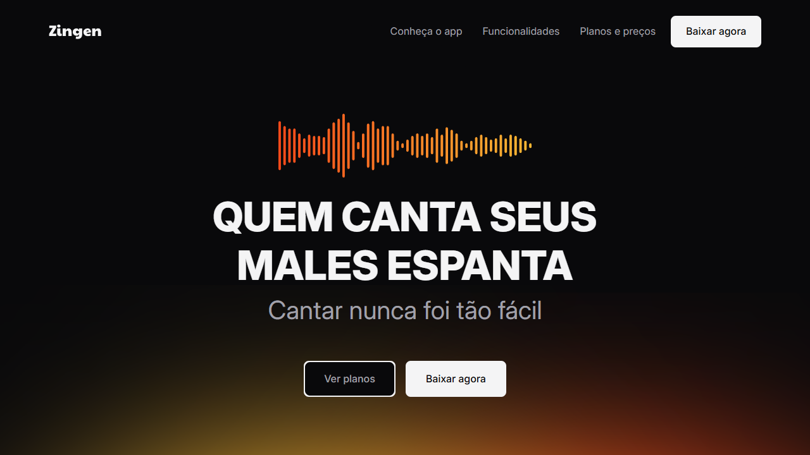
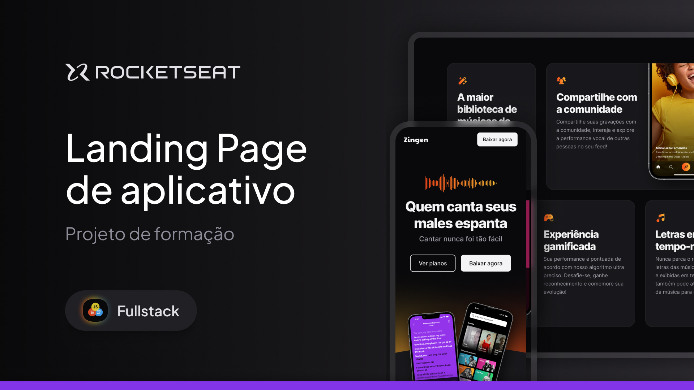

<h1 align="center">
  
</h1>

<div align="center">
  <a href="#📸-visão-do-projeto--project-view">📸 Visão do Projeto | Project View</a> -
  <a href="#ℹ-sobre-o-projeto--about-the-project">ℹ Sobre o Projeto | About the Project</a> -
  <a href="#🏗-principais-funcionalidades--main-features">🏗 Principais Funcionalidades | Main Features</a> -
  <a href="#⚙️-tecnologias--technologies">⚙️ Tecnologias | Technologies</a> -
  <a href="#🧪-testar-o-projeto---clique-no-botão--test-the-project---click-on-the-button">🧪 Testar o Projeto - Clique no botão | Test the Project - Click on the button</a> -
  <a href="#🎨-layout---clique-na-miniatura--layout---click-on-the-thumbnail">🎨 Layout - Clique na miniatura | Layout - Click on the thumbnail</a> -
  <a href="#💻-clonagem-do-repositório--repository-cloning">💻 Clonagem do Repositório | Repository Cloning</a> -
  <a href="#🤝-contribuições--contributions">🤝 Contribuições | Contributions</a> -
  <a href="#👨‍💻-autor--author">👨‍💻 Autor | Author</a>
</div>

## 📸 Visão do Projeto | Project View

<div align="center">
  
  

</div>

## ℹ Sobre o Projeto | About the Project

### 🌐 Português

O projeto em questão é uma landing page desenvolvida para promover o aplicativo Zingen (app fictício), uma plataforma destinada a quem deseja aprender a cantar de maneira divertida e interativa. A situação inicial do projeto envolveu a criação de uma página que apresentasse as funcionalidades principais do app e incentivasse os usuários a baixá-lo, ao mesmo tempo que transmitisse uma experiência visual envolvente e moderna.

A tarefa foi construir uma landing page que fosse clara, responsiva e visualmente atraente, destacando as funcionalidades e planos de assinatura do Zingen, além de fornecer detalhes sobre o app, como a capacidade de remover a voz de músicas e comparar a performance vocal do usuário através de um algoritmo de Inteligência Artificial. A interface precisava ser simples e intuitiva, além de compatível com diferentes dispositivos, desde desktops até smartphones, garantindo uma boa experiência em qualquer formato de tela.

Para alcançar isso, a ação envolveu o uso de HTML5, CSS3 e algumas funcionalidades de design responsivo. A estrutura foi dividida em seções, como um cabeçalho com navegação clara, uma área principal (herói) com destaque para o app, seções sobre as funcionalidades, planos e preços, além de botões de ação que direcionam o usuário para o download do app. A landing page também incluiu ilustrações e ícones específicos para cada funcionalidade do aplicativo, o que facilitou a visualização das características de forma mais interativa e dinâmica.

O resultado foi uma landing page limpa e organizada, com foco na conversão. O design utilizou cores fortes e elementos visuais atrativos, como as ilustrações e ícones, para engajar os visitantes. A navegação foi otimizada, com links para as seções de funcionalidade e planos, e com botões visíveis para download, incluindo links para a App Store e Play Store. A página também é completamente responsiva, funcionando bem em diferentes dispositivos, o que é essencial para garantir uma boa experiência de usuário.

No processo, um dos aprendizados importantes foi a importância de usar design responsivo para garantir que a página se adaptasse facilmente a diferentes tamanhos de tela, desde smartphones até desktops. Além disso, a escolha de tipografia simples e moderna, através do Google Fonts, e a estruturação clara das seções contribuiu para uma navegação fácil e intuitiva. O foco na experiência do usuário foi fundamental para criar uma página eficaz, capaz de atrair visitantes e incentivá-los a baixar o aplicativo.

### 🌐 English

The project in question is a landing page developed to promote the Zingen app (fictitious app), a platform designed for those who want to learn how to sing in a fun and interactive way. The initial situation of the project involved creating a page that showcased the main features of the app and encouraged users to download it, while providing an engaging and modern visual experience.

The task was to build a landing page that was clear, responsive, and visually appealing, highlighting the features and subscription plans of Zingen, as well as providing details about the app, such as the ability to remove vocals from songs and compare the user's vocal performance through an AI algorithm. The interface needed to be simple and intuitive, as well as compatible with different devices, from desktops to smartphones, ensuring a good experience on any screen size.

To achieve this, the action involved using HTML5, CSS3, and some responsive design features. The structure was divided into sections, such as a header with clear navigation, a main (hero) area highlighting the app, sections about the features, plans and pricing, along with action buttons that directed users to download the app. The landing page also included illustrations and icons specific to each app feature, which made it easier to visualize the characteristics in a more interactive and dynamic way.

The result was a clean and organized landing page with a focus on conversion. The design used bold colors and attractive visual elements, such as illustrations and icons, to engage visitors. The navigation was optimized with links to the features and plans sections, and with visible download buttons, including links to the App Store and Play Store. The page is also fully responsive, working well across different devices, which is essential to ensure a good user experience.

In the process, one of the important takeaways was the significance of using responsive design to ensure the page adapted easily to different screen sizes, from smartphones to desktops. Additionally, the choice of simple and modern typography, through Google Fonts, and the clear structuring of sections contributed to easy and intuitive navigation. Focusing on the user experience was key to creating an effective page capable of attracting visitors and encouraging them to download the app.

## 🏗 Principais Funcionalidades | Main Features

### 🌐 Português

- [x] **Exibição de informações sobre o app:** Descrição clara sobre como o Zingen funciona, destacando seu uso de inteligência artificial para remover a voz das músicas e permitir uma experiência de Karaokê.

- [x] **Chamada para ação (CTA) - Baixar o app:** Botões de destaque como "Baixar agora", facilitando o acesso direto ao download do aplicativo.

- [x] **Exibição das funcionalidades do app:** Seções detalhadas explicando as principais funcionalidades do Zingen, como remoção de voz, experiência gamificada, gravação de performances e letras sincronizadas.

- [x] **Planos e preços:** Apresentação clara dos diferentes planos de assinatura (Básico, Premium e Família), com seus respectivos benefícios, incluindo a opção de assinatura gratuita e paga.

- [x] **Design responsivo:** Layout adaptável, com visual otimizado tanto para dispositivos móveis quanto para desktop, garantindo uma experiência fluida em qualquer plataforma.

- [x] **Informações sobre o download:** Links diretos para a App Store e Play Store, facilitando o processo de download do aplicativo para o usuário.

- [x] **Visuais atraentes e interativos:** Uso de ícones e ilustrações chamativas para explicar as funcionalidades do aplicativo, tornando a experiência mais visualmente interessante.

### 🌐 English

- [x] **App information display:** Clear description of how Zingen works, highlighting its use of artificial intelligence to remove vocals from songs and allow a Karaoke experience.

- [x] **Call to action (CTA) - Download the app:** Prominent buttons like "Download now" for easy access to download the app.

- [x] **App features display:** Detailed sections explaining the main features of Zingen, such as vocal removal, gamified experience, performance recording, and synchronized lyrics.

- [x] **Plans and pricing:** Clear presentation of different subscription plans (Basic, Premium, and Family), with their respective benefits, including both free and paid options.

- [x] **Responsive design:** Adaptive layout, with optimized visuals for both mobile and desktop devices, ensuring a seamless experience on any platform.

- [x] **Download information:** Direct links to the App Store and Play Store, making it easy for users to download the app.

- [x] **Attractive and interactive visuals:** Use of icons and illustrations to explain the app’s features, making the experience more visually engaging.

## ⚙️ Tecnologias | Technologies

- <a href="https://www.w3schools.com/html/default.asp"> HTML</a>
- <a href="https://www.w3schools.com/css/"> CSS</a>

## 🧪 Testar o Projeto - Clique no botão | Test the Project - Click on the button

<a href="https://henry-frrz.github.io/zingen/">
  
</a>

## 🎨 Layout - Clique na miniatura | Layout - Click on the thumbnail

<a align="center" href="https://www.figma.com/community/file/1371886246180677672">
  
</a>

## 💻 Clonagem do Repositório | Repository Cloning

### 🌐 Português

1. **Requisitos:** Você precisa apenas de um navegador para executar este projeto.

2. **Baixar o Projeto:** Clique no botão **Code** e selecione **Download ZIP**, depois extraia os arquivos no local desejado. Alternativamente, você pode clonar o repositório usando Git:

```bash
git clone https://github.com/henry-frrz/zingen.git
```

3. **Abrir o Projeto:** Localize os arquivos extraídos ou clonados e abra o arquivo `index.html` no seu navegador.

### 🌐 English

1. **Requirements:** You only need a web browser to run this project.

2. **Download the Project:** Click on the **Code** button and select **Download ZIP**, then extract the files to your preferred location. Alternatively, you can clone the repository using Git:

```bash
git clone https://github.com/henry-frrz/zingen.git
```

3. **Open the Project:** Locate the extracted or cloned files and open the index.html file in your browser.

## 🤝 Contribuições | Contributions

### 🌐 Português

Se você deseja contribuir para o projeto, siga as diretrizes abaixo:

1. Faça um fork do repositório no GitHub.

2. Crie uma nova branch para sua contribuição:

```bash
git checkout -b feature/sua-contribuicao
```

3. Faça as alterações necessárias e teste para garantir que as mudanças sejam robustas e confiáveis.

4. Envie suas alterações com um pull request (PR).

5. Após revisão e aprovação, suas alterações serão incorporadas ao projeto.

### 🌐 English

If you would like to contribute to the project, please follow the contribution guidelines below:

1. Fork the repository on GitHub.

2. Create a new branch for your contribution:

```bash
git checkout -b feature/your-contribution
```

3. Make any necessary changes, and test them to ensure that the changes are robust and reliable.

4. Submit your changes with a pull request (PR).

5. After review and approval, your changes will be incorporated into the project.

## 👨‍💻 Autor | Author

<a href="https://github.com/henry-frrz">

</a>
<br>
